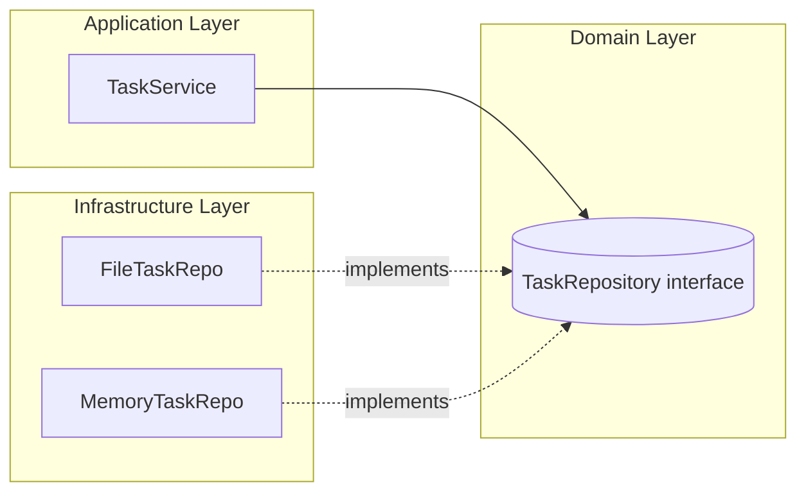

# Design Document — TodoApp

## 1. Purpose

This document explains the internal design and architecture of **TodoApp**,  
a simple command-line task management application written in Go.

The goal is not to build a production-ready system,  
but to practice **clean architecture**, **responsibility separation**, and **extensibility** in Go.

---

## 2. Design Philosophy

TodoApp follows a layered design inspired by **Clean Architecture** and **Domain-Driven Design (DDD)**.

### Key Principles

- **Separation of concerns**  
  Each layer has a single responsibility: domain rules, use cases, or persistence.

- **Dependency inversion**  
  Upper layers depend only on interfaces, not concrete implementations.

- **Replaceable infrastructure**  
  The data store (in-memory or JSON) can be swapped without touching business logic.

- **Simplicity first**  
  Start small and extend gradually — from memory → JSON → database.

---

## 3. Architecture

- **cmd/todo**: CLI front-end — handles user commands and arguments  
- **Application**: Encapsulates main operations (`Add`, `List`, `Done`)  
- **Domain**: Core business model (`Task`) and repository abstraction  
- **Infrastructure**: Actual persistence (in-memory map or JSON file)

### 1. Application Layer

The application layer contains TaskService, which implements the main use cases.

Responsibilities

- Create new tasks
- Mark tasks as completed
- Retrieve all tasks

It does not know how data is stored — it only calls TaskRepository.

This makes it testable and independent from infrastructure details.

### 2. Domain Layer

The **domain layer** defines the central business rules.

### Entity: `Task`

| Field | Type | Description |
|-------|------|-------------|
| ID    | int  | Unique identifier |
| Title | string | Task title |
| Done  | bool | Completion status |

### Interface: `TaskRepository`

```go
type TaskRepository interface {
    NextID() int
    Save(t Task) error
    FindAll() ([]Task, error)
    FindByID(id int) (Task, error)
    Update(t Task) error
}
```

This interface abstracts the persistence mechanism —
it could be memory, JSON file, or SQL database

### 3. Infrastructure Layer

The infrastructure layer provides concrete implementations of TaskRepository.

MemoryTaskRepo

- Keeps data in memory using a map[int]Task
- Used for development or unit testing
- Volatile: data disappears when the app exits

FileTaskRepo

- Persists data in db/tasks.json
- Uses encoding/json to serialize/deserialize tasks
- Thread-safe (sync.Mutex)

Automatically creates the file if it doesn’t exist

## 4. Data Flow

```
User Command → CLI (main.go)
             → TaskService (Application Layer)
             → TaskRepository (Interface)
             → FileTaskRepo (JSON Storage)
```



### Dependency Direction

CLI → Application → Domain ← Infrastructure

- The **CLI** depends on the **Application** layer.
- The **Application** depends on **Domain** abstractions.
- The **Infrastructure** implements interfaces defined in the **Domain**.

This ensures one-way dependencies and supports the **Dependency Inversion Principle (DIP)**.
